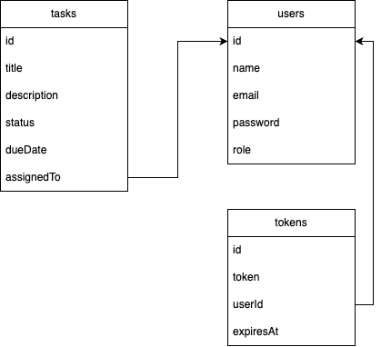

# Taskome - Task Management Application

A simple task management application with user authentication and role-based access control.

## Schema

Here's the database schema for the application:



## Features

**Task Management:**

- Create, read, update, and delete tasks.
- Assign tasks to users.
- Track task status and due dates.

**User Authentication:**

- User registration and login.
- Secure password storage using bcrypt.
- JWT-based authentication.

**Role-Based Access Control (RBAC):**

- Different user roles with varying levels of access.

**API Endpoints:**

- Well-defined RESTful API for interacting with the application.

**Caching:**

- Utilizes Redis for caching task data to improve performance.

## Technologies Used

- Node.js
- Express.js
- MongoDB
- Mongoose
- Redis
- JSON Web Tokens (JWT)
- bcrypt
- Docker (for containerization)
- Jest and Chai (for testing)
- Supertest (for API testing)

## Getting Started

### Prerequisites

- Node.js (version >= 18)
- npm (or yarn)
- Docker (optional, for containerized development)
- MongoDB Atlas account and connection string
- Redis Cloud account and connection URL

### Installation

1.  Clone the repository:

    ```bash
    git clone https://github.com/f-chilmi/taskome.git
    cd taskome
    ```

2.  Install dependencies:

    ```bash
    npm install
    ```

3.  Create a `.env` file in the root directory and configure your environment variables (refer to the `.env.example` example provided). **Make sure to replace the placeholder values with your actual credentials and connection strings.**

4.  (Optional) If using Docker:

    ```bash
    docker-compose up
    ```

### Running the Application

```bash
npm run dev
```

The application will be running on the port specified in your .env file (default is 8080).

### Running Tests

```bash
npm test
```

This will run all the unit and integration tests using Jest and Chai.

## API Endpoints

- `POST /auth/register`: Register a new user.
- `POST /auth/login`: Log in an existing user and get JWT tokens.
- `GET /tasks`: Get a list of tasks (requires authentication).
- `POST /tasks`: Create a new task (requires authentication).
- `GET /tasks/:id`: Get a specific task by ID (requires authentication).
- `PUT /tasks/:id`: Update a task (requires authentication and appropriate role).
- `DELETE /tasks/:id`: Delete a task (requires authentication and appropriate role).
- `GET /users`: Get a list of users (requires admin role).

## Deployment

The application is containerized using Docker and can be deployed to various cloud providers. Refer to the deployment guides of your chosen provider (e.g., Render, Railway, Fly.io). **Remember to configure environment variables (especially sensitive ones) directly in your cloud provider's settings**.
